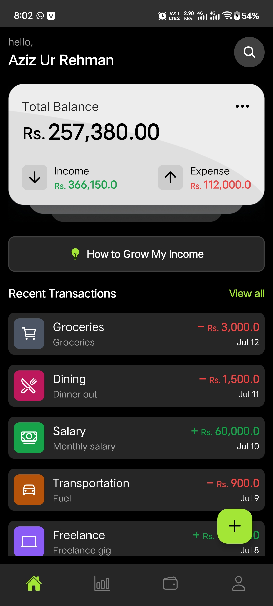
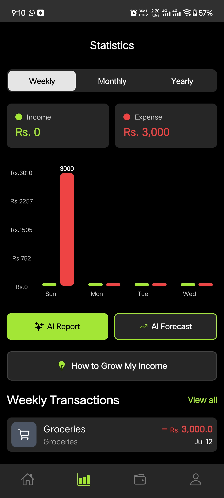
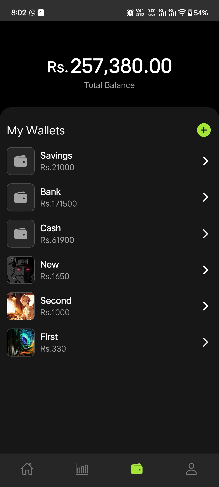
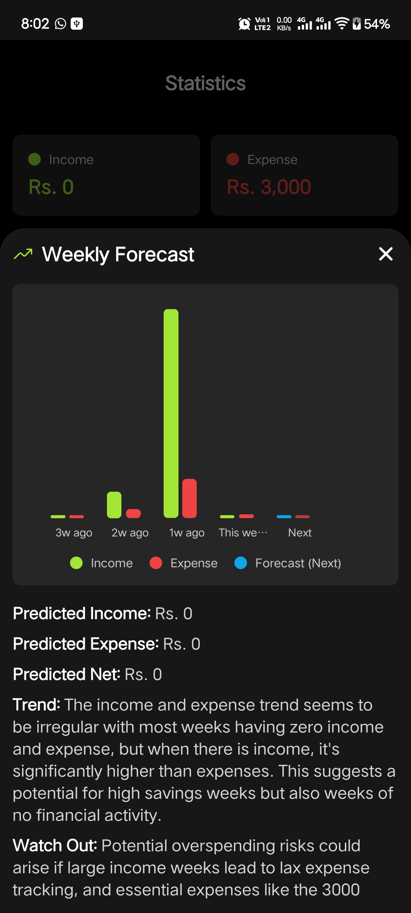

<div align="center">


# 💸 Expense Tracker

### Your money, beautifully organized — powered by AI.

A cross-platform personal-finance app to track **wallets**, log **income & expenses**, attach **receipts**, visualize **spending trends**, and get **AI-driven reports, forecasts, and income ideas** — on Android, iOS, and Web.

<br/>


</div>

---

## ✨ Overview

**Expense Tracker** is a modern money manager built with **React Native + Expo Router**. It uses **Firebase** for authentication and real-time data, **Cloudinary** for receipt image hosting, and **Groq's LLaMA 3.3** model to turn your raw transactions into plain-English insights — spending reports, spending forecasts (with charts), and personalized ways to grow your income.

---

## 📱 Features

### 💼 Core

- 🔐 **Email password auth**
- 👛 **Multiple wallets**
- 🔁 **Transactions**
- 🧾 **Receipt photos**
- 📊 **Statistics**
- 🔎 **All Transactions screen**

### 🤖 AI-Powered

- 📝 **AI Report** — a friendly summary of the selected period: overview, top spending, savings, and tips
- 🔮 **AI Forecast** — predicts next week/month/year from your trends, shown as a **bar chart** (recent periods + predicted "Next") with a written breakdown
- 💡 **Grow My Income** — pick your field (e.g. _Software Development_) and get tailored income streams, skills to learn, quick wins, and an earning range — your preference is **remembered** across launches
- ⚡ **Smart caching** — unchanged data reuses the previous AI result instead of calling the API again

### 🎨 Experience

- 🖌️ **Custom themed alert modal** app-wide (no default OS pop-ups)
- 🧭 **File-based routing** with Expo Router + typed routes
- 🌗 Dark, focused UI with reusable components and haptics

---

## 🤖 AI Integration

The app integrates **[Groq](https://groq.com)** (OpenAI-compatible API) running the
**`llama-3.3-70b-versatile`** model to turn raw transactions into useful, plain-English
insights. All AI logic lives in [`services/ai_services.ts`](services/ai_services.ts).

### What it powers

| Feature            | What it does                                                                                                                                     | Data sent to the model                                                    |
| ------------------ | ------------------------------------------------------------------------------------------------------------------------------------------------ | ------------------------------------------------------------------------- |
| **AI Report**      | Summarizes the selected period — overview, top spending, savings, tips                                                                           | An **aggregated summary** (totals + per-category breakdown), not raw docs |
| **AI Forecast**    | Predicts next week/month/year and renders it as a **bar chart** (recent periods + predicted "Next")                                              | Per-period income/expense **history**; returns strict JSON for the chart  |
| **Grow My Income** | Concrete, numbered side-hustle ideas tailored to a chosen field (e.g. _Software Development_), each with a how-to and an estimated monthly range | The selected **industry** + total recorded income as loose context        |

### How it works

1. Transactions are **aggregated locally** (per-category totals, per-period history) before any request — raw documents are never shipped to the model, keeping calls small and fast.
2. Requests go to `https://api.groq.com/openai/v1/chat/completions` with the key from `EXPO_PUBLIC_GROQ_API_KEY`. The forecast uses **JSON mode** (`response_format: json_object`) so its numbers can drive the chart.
3. Results are **cached** by a signature of the underlying data (period + kind + transactions, or industry + income bracket). If nothing changed, the previous result is reused — **no repeat API call**.
4. The industry preference for **Grow My Income** is remembered across launches via **AsyncStorage**.
5. Every AI call is **logged** (`[AI] …`) so you can trace key presence, request status, timing, and token usage in the Metro console.

> **Setup:** add `EXPO_PUBLIC_GROQ_API_KEY` to `.env` (get a free key at
> [console.groq.com/keys](https://console.groq.com/keys)) and restart with
> `npx expo start -c`. Since `EXPO_PUBLIC_*` values are bundled into the client,
> proxy AI calls through a backend for production.

---

## 🖼️ Screenshots

<div align="center">

|                          Home                          |                          Statistics                          |                          Wallets                          |
| :----------------------------------------------------: | :----------------------------------------------------------: | :-------------------------------------------------------: |
|  |  |  |

|                             All Transactions                             |                          AI Forecast                          |                             Grow My Income                             |
| :----------------------------------------------------------------------: | :-----------------------------------------------------------: | :--------------------------------------------------------------------: |
|  |  |  |

</div>

---

## 🚀 Getting Started

### Prerequisites

- **Node.js 18+** and npm
- A **Firebase** project (Auth + Firestore enabled)
- A **Cloudinary** account with an unsigned upload preset
- A free **Groq API key** — [console.groq.com/keys](https://console.groq.com/keys)
- Expo Go, or an Android emulator / iOS simulator

### Installation

```bash
# 1. Clone
git clone <your-repo-url>
cd expense-traking

# 2. Install dependencies
npm install

# 3. Create your environment file
cp .env.example .env      # then fill in your credentials (see below)

# 4. Start the app
npx expo start
```

Then open it in **Expo Go** (scan the QR), an **emulator/simulator**, or the **web** browser.

> 💡 After changing `.env`, restart the bundler with a cleared cache so the new
> values are picked up: `npx expo start -c`.

---

## 🔑 Environment Variables

Copy `.env.example` → `.env` and fill in your own values:

| Variable                                   | Where to get it                                          |
| ------------------------------------------ | -------------------------------------------------------- |
| `EXPO_PUBLIC_FIREBASE_API_KEY`             | Firebase console → Project settings → Your apps          |
| `EXPO_PUBLIC_FIREBASE_AUTH_DOMAIN`         | Firebase console                                         |
| `EXPO_PUBLIC_FIREBASE_DATABASE_URL`        | Firebase console                                         |
| `EXPO_PUBLIC_FIREBASE_PROJECT_ID`          | Firebase console                                         |
| `EXPO_PUBLIC_FIREBASE_STORAGE_BUCKET`      | Firebase console                                         |
| `EXPO_PUBLIC_FIREBASE_MESSAGING_SENDER_ID` | Firebase console                                         |
| `EXPO_PUBLIC_FIREBASE_APP_ID`              | Firebase console                                         |
| `EXPO_PUBLIC_CLOUDINARY_CLOUD_NAME`        | Cloudinary dashboard                                     |
| `EXPO_PUBLIC_CLOUDINARY_UPLOAD_PRESET`     | Cloudinary → Settings → Upload → unsigned preset         |
| `EXPO_PUBLIC_GROQ_API_KEY`                 | [Groq console → API Keys](https://console.groq.com/keys) |

> ⚠️ `EXPO_PUBLIC_*` variables are **bundled into the client app** and can be
> extracted from a shipped build. Don't put private server secrets here. For
> production, proxy AI calls through a backend. `.env` is git-ignored and must
> never be committed.

---

## 📂 Project Structure

```text
app/            # Expo Router screens
 ├─ (auth)/     #   login, register, welcome
 ├─ (tabs)/     #   home, statistics, wallet, profile
 ├─ (modals)/   #   transaction, wallet, profile, search
 └─ all_transactions.tsx   # full history + search & filters
components/     # Reusable UI (custom_alert, income_ideas, charts, inputs…)
config/         # Firebase initialization
constants/      # Theme, models, categories, sizes
context/        # Auth provider
hooks/          # Custom hooks (useFetchData…)
services/       # Firestore, Cloudinary & AI (Groq) wrappers
scripts/        # Utilities (seed_test_data.js)
assets/         # Images & fonts
```

---

## 📜 Available Scripts

| Command           | Description               |
| ----------------- | ------------------------- |
| `npm start`       | Start the Expo dev server |
| `npm run android` | Build & run on Android    |
| `npm run ios`     | Build & run on iOS        |
| `npm run web`     | Run in the browser        |
| `npm run lint`    | Lint the project          |

### 🌱 Seed demo data

Populate a test account with sample wallets & transactions:

```bash
# loads .env, signs in (or creates) the tester account, seeds Firestore
set -a && . ./.env && set +a && node scripts/seed_test_data.js
```

---

## 🔒 Security Notes

- Never commit `.env` — only `.env.example` is tracked.
- Rotate any credentials that were ever pushed to a public repo.
- Keep **Firestore Security Rules** strict — the client API key only identifies the project; rules are what protect your data.
- Use **unsigned** Cloudinary presets on the client; never ship an API secret.
- The Groq key is client-side (`EXPO_PUBLIC_`) — fine for demos, but proxy it via a backend for production.

---

<div align="center">

Built with ❤️ using **React Native**, **Expo**, **Firebase** & **Grok**.

⭐ Star this repo if you find it useful!

</div>
